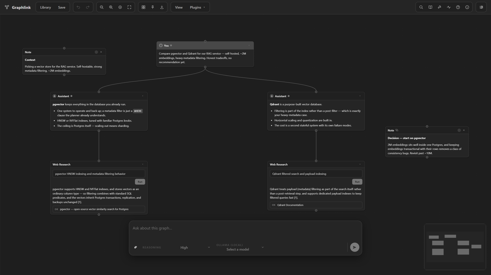
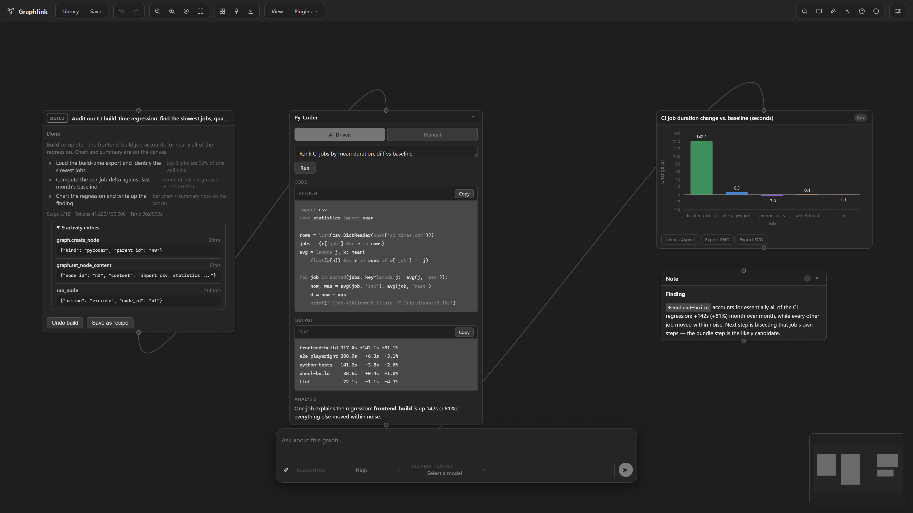
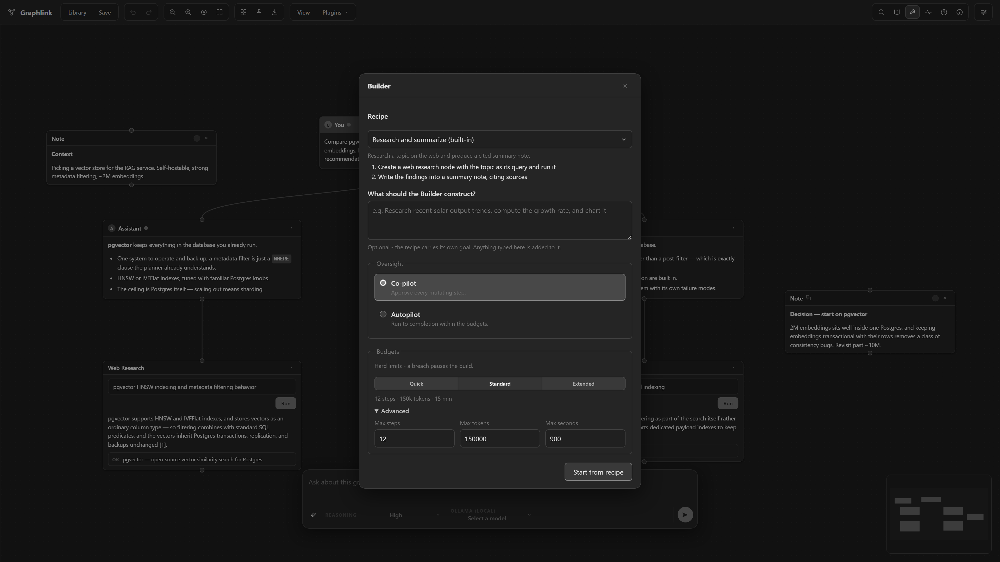
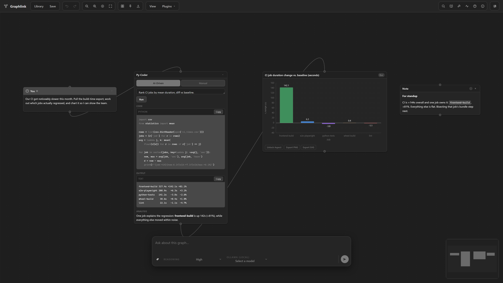

<div align="center">

# GraphLink




**A local-first, graph-based AI workspace for branching reasoning, tool use, and multi-provider workflows.**

</div>

---

Graphlink replaces the linear chat window with a visual canvas of connected nodes. Instead of forcing every interaction into a single timeline, it lets you branch: conversations, code generation, web research, drafting, and execution each live as their own node, and every branch can follow its own line of inquiry with its own model and context.

It is built with a Python (FastAPI) backend and a Vite/React/TypeScript single-page app, launched as one native desktop window via `pywebview` — not a browser tab, not Qt. It runs entirely on your machine, and works with local model runtimes (Ollama, llama.cpp) as well as hosted APIs (OpenAI-compatible, Anthropic Claude, Google Gemini).

> Graphlink is the second generation of the **Graphite** project, renamed to avoid collision with unrelated software. The rename is complete: modules, folders, and the UI all use the `graphlink` name.

## Table of Contents

- [Features](#features)
- [Screenshots](#screenshots)
- [The Builder](#the-builder)
- [Plugins](#plugins)
- [Getting Started](#getting-started)
- [Configuration](#configuration)
- [Usage](#usage)
- [Architecture](#architecture)
- [Contributing](#contributing)
- [Troubleshooting](#troubleshooting)
- [Limitations](#limitations)
- [License and Security](#license-and-security)

## Features

- **Visual branching canvas** — build parallel thought paths, experiments, and delivery tracks in one view instead of one scrolling thread.
- **The Builder** — give it a goal and it plans a checklist, then constructs it on your canvas one supervised step at a time, under hard step/token/time budgets (see [The Builder](#the-builder)).
- **Multiple model backends** — run locally with Ollama or direct GGUF loading via `llama-cpp-python`, or switch to API Endpoint mode for OpenAI-compatible, Anthropic Claude, or Google Gemini. The active mode is switchable in Settings.
- **Per-branch model routing** — pin a specific model to a node or a whole branch, on top of the per-task model defaults.
- **Plugin nodes** — attach specialist nodes for web research, code execution, drafting, and repository-aware changes (see [Plugins](#plugins)), plus a plugin SDK with per-plugin capability grants and optional MCP server integration.
- **Repository-aware editing** — Gitlink loads a GitHub repo into structured context, previews file-level changes, and only writes after explicit approval.
- **Knowledge base and search** — ingest documents into a local knowledge store, search it from a node, and search across every workspace at once.
- **Workspaces and library** — organize graphs into workspaces with favorites, tags, and archiving; reopen any of them from the Library.
- **Undo that understands agents** — full undo/redo over canvas history, including "undo this build", which reverts everything one agent run did as a single action.
- **Charts** — generate a chart from any node's content and export it as PNG or SVG.
- **Attachments** — stage images, audio, or documents onto a message; the backend classifies and extracts them.
- **Themes and canvas controls** — light and dark themes, plus grid, connection routing, node font, and pan-sensitivity controls.
- **Local-first persistence** — conversations, notes, navigation pins, and graph layout are stored locally in SQLite, with crash recovery.
- **Diagnostics** — a token and cost counter, a command palette, and an exportable diagnostic bundle for troubleshooting.
- **Export** — save the whole canvas as a PNG, or export individual nodes: Chat as Markdown, Code as a source file (extension inferred from language), Image as PNG.

Built-in node kinds on the graph surface: **Chat**, **Code**, **Document**, **Thinking**, **HTML**, **Image**, **Conversation**, **Web Research**, **Plan** (the Builder's checklist), **Artifact**, **Gitlink**, **Py-Coder**, **Code Sandbox**, **Note**, and **Chart** — plus Frames, Containers, and Navigation Pins for organizing them.

## Screenshots

**A build, on the canvas.** The plan node holds the checklist, the live budget counters, and an activity log of every tool call the run made — next to the nodes it actually created.



**Launching a build.** Pick a recipe (its steps are previewed before you commit), choose how much oversight you want, and set the budgets.



**Code and charts inline.** Py-Coder runs Python in a persistent REPL; any node's content can become a chart.



## The Builder

The Builder takes a goal and builds it on your canvas, rather than describing how you could.

1. **It plans first.** The goal becomes a short checklist that lands as a real node — review it, edit it, and only then start the run.
2. **It works one step at a time,** using the same tools available to you: creating and editing nodes, running Python, generating replies and charts, running web research, and searching your knowledge base.
3. **You choose the oversight.** *Co-pilot* asks you to approve every mutating step. *Autopilot* runs to completion within its budgets. Network access asks every time, in either mode.
4. **Budgets are hard limits.** Steps, tokens, and wall time are capped before the run starts; a breach pauses the build with its state intact instead of losing progress.
5. **Everything is reversible and resumable.** The plan node *is* the resume point, so a paused, stopped, or failed build picks up where it left off — even after restarting the app. "Undo build" reverts everything the run did in one action.
6. **Finished builds become recipes.** Save a build's plan and reuse it; two recipes ship built in.

Every tool call a run makes is recorded on the plan node with its outcome and timing, so a build is auditable after the fact rather than opaque.

## Plugins

Attach these specialist nodes to a branch from the plugin picker:

| Plugin | Category | What it does |
| --- | --- | --- |
| System Prompt | Branch Foundations | Attaches a branch-scoped system prompt that shapes model behavior for that path only. |
| Conversation Node | Branch Foundations | A self-contained linear chat inside a single node. |
| Web Research | Reasoning & Research | Web retrieval, summarization, and source capture for real-time information. |
| Gitlink | Build & Execution | Loads a GitHub repo into structured context, previews file-level changes, and writes only after approval. |
| Py-Coder | Build & Execution | Runs Python with AI-assisted generation, execution, and analysis. |
| Virtual Environment Runner | Build & Execution | Runs Python in a per-node virtualenv with declared dependencies (isolates installed packages, not the OS or filesystem/network access). |
| HTML Renderer | Build & Execution | Renders HTML from a parent branch directly inside the app. |
| Artifact / Drafter | Workflow & Drafting | A split-pane surface for drafting and refining long-form Markdown. |

## Getting Started

### Requirements

- Python 3.10 or newer. Windows is the primary development target today.
- Node.js 24 or newer, needed only to build the frontend once (`web_ui/.nvmrc` pins the exact version this project is developed against).
- Internet access is optional, and only needed for API Endpoint mode, GitHub-backed plugins, and web research.

### Install and run

```powershell
git clone <your-repo-url> graphlink
cd graphlink

py -m venv .venv
.venv\Scripts\Activate.ps1
pip install --upgrade pip
pip install -r requirements.txt

cd web_ui
npm install
npm run build
cd ..

python graphlink_desktop.py
```

`graphlink` above is the repo root (containing `requirements.txt` and `graphlink_desktop.py`). Dependencies — FastAPI, uvicorn, pywebview, the provider SDKs, web-search/spellcheck/charting/audio helpers, and the export/parsing libraries — install from `requirements.txt` in a single step. `llama-cpp-python` is optional (only needed for Llama.cpp local mode; Ollama is the built-in local path) — install it separately with `pip install llama-cpp-python`. Building the frontend (`npm run build`, inside `web_ui/`) only needs to be redone when `web_ui/` changes.

> `graphlink_desktop.py` starts the Python backend, waits for it to report healthy, then opens a single native window (via `pywebview`) pointed at it — there is no separate frontend dev server to run and no browser tab involved. It requires `web_ui/dist/app/index.html` to already exist; if the frontend hasn't been built yet it logs an error naming the missing step and exits rather than building it for you.

On first launch, Graphlink creates `~/.graphlink/` to hold your sessions and settings (see [Architecture](#architecture)).

### Choose a model backend

Ollama (Local) is the default. All three modes are configurable *and* switchable in **Settings**.

- **Ollama (Local)** — the default. Best for local-first use with Ollama-managed models.
- **Llama.cpp (Local)** — direct GGUF loading through `llama-cpp-python`, with runtime controls.
- **API Endpoint** — OpenAI-compatible providers, Anthropic Claude, or Google Gemini.

## Configuration

Model selection and provider settings live in **Settings**. Every per-task model is configurable there and persists across launches — nothing is permanently hardcoded.

### Ollama (Local)

Nothing is preconfigured — `qwen3:8b` and `deepseek-coder:6.7b` were an earlier version's hardcoded defaults and are now treated as legacy markers, not live ones. There is no model until you assign one:

```powershell
ollama serve
ollama pull qwen3:8b
```

Then open **Settings > Ollama**, run **Scan** to discover locally-pulled models, and assign one to each task (chat, naming, chart generation; web research falls back to your chat model). Sending a message before a task has an assigned model raises "No Ollama model configured for task: ...".

### Llama.cpp (Local)

Loads a GGUF file directly (not an Ollama model store). Configure the chat model file, an optional naming model, reasoning mode, and runtime controls (`n_ctx`, `n_gpu_layers`, `n_threads`, optional `chat_format`) in Settings. Text chat and title generation are supported; image and audio attachments are not available in this mode, and image generation remains API-only.

### API providers

OpenAI-Compatible, Anthropic Claude, and Google Gemini are supported, with per-task model selection. Image generation works with OpenAI-Compatible and Google Gemini providers (not Anthropic Claude). Anthropic Claude accepts image attachments but not audio (use Gemini or Ollama for audio).

### Environment variables

The app reads these as fallbacks when no key is saved in Settings, or for model discovery. The in-app Settings flow is the primary configuration surface; these mostly matter during development.

| Variable | Purpose |
| --- | --- |
| `GRAPHLINK_OPENAI_API_KEY` / `OPENAI_API_KEY` | OpenAI-Compatible key |
| `GRAPHLINK_ANTHROPIC_API_KEY` / `ANTHROPIC_API_KEY` | Anthropic Claude key |
| `GRAPHLINK_GEMINI_API_KEY` / `GEMINI_API_KEY` | Google Gemini key |
| `LLAMA_CPP_MODELS` | Root folder scanned for GGUF files in Llama.cpp mode |
| `OLLAMA_MODELS` | Override for Ollama's model storage root during model discovery |

> The legacy `GRAPHITE_*`-prefixed names (e.g. `GRAPHITE_OPENAI_API_KEY`) from before the app was renamed still work as a fallback, below the `GRAPHLINK_*` names in priority.

## Usage

- **Start** with a chat node or a starter prompt.
- **Branch** by selecting a node and adding a plugin from the picker or controls; each new node begins a more specialized path (research, code, drafting, execution).
- **Delegate** a multi-step task to the Builder — it plans a checklist, then constructs it on the canvas under your chosen level of oversight (see [The Builder](#the-builder)).
- **Deliver** with build-oriented nodes — Gitlink for repo-aware change proposals, Py-Coder and Virtual Environment Runner for running code, Artifact / Drafter for documents.
- **Attach** images, audio, or documents to a message from the composer; staged attachments are classified and extracted on the backend, and can be reviewed before sending.
- **Ingest** documents into the local knowledge base, then search it from a node — or search across every workspace at once with Global Search.
- **Undo** anything, including a whole agent run in one action.
- **Export** the whole canvas as a PNG, or export individual nodes — Chat as `.md`, Code as a source file (extension inferred from language, falling back to `.txt`), Image as `.png`.

## Architecture

Graphlink is a Python (FastAPI) backend paired with a Vite/React/TypeScript single-page app, launched as one native desktop window via `pywebview` — not a browser tab, not Qt.

- **`graphlink_desktop.py`** (repo root) is the native window shell: it starts the backend in a background thread, waits for it to report healthy, then opens a single OS webview window (WebView2 on Windows) pointed at the backend's own URL. The backend serves the built frontend, the REST API, and the WebSocket on that one origin.
- **`backend/`** holds all real application and domain logic: the FastAPI app factory and a WebSocket pub/sub event bus, the node-graph/canvas model (every node kind, connections, autosave, crash recovery), an undoable command layer, LLM dispatch, the agent tool-use loop behind the Builder, the knowledge store and search, settings, chat-library/workspace management, and session load/save.
- **`web_ui/`** is the React SPA (built with Vite) — the entire UI: the canvas surface, the app bar and composer chrome, and dialogs/overlays. It talks to the backend over the REST API and the WebSocket.
- **`contracts/`** is build-time-only codegen that generates the TypeScript types and JSON Schemas for WebSocket payloads from the backend's Python dataclasses, keeping the two sides in sync.
- **`graphlink_plugins/`** holds the domain logic behind the plugin nodes (web research, Gitlink, Py-Coder, Virtual Environment Runner) — no UI code, no Qt.
- **`plugins/`** holds the plugin *packages* themselves — one directory per plugin with a `plugin.py` and a `plugin.toml`, discovered at startup. This is the extension point: the built-ins live here alongside the SDK's example plugins.

Your data lives entirely on your machine:

```text
~/.graphlink/chats.db      graph sessions, workspaces, notes, pins, and the knowledge store
~/.graphlink/session.dat   local settings and saved credentials
~/.graphlink/running.lock  crash-detection sentinel, written on launch and removed on clean exit
~/.graphlink/graphlink.log rotating application log (2 MB cap)
```

For a detailed, current map of where behavior lives in the codebase, see [GRAPHLINK_REPO_NAVIGATION.md](GRAPHLINK_REPO_NAVIGATION.md).

## Contributing

Contributions are welcome. See [CONTRIBUTING.md](CONTRIBUTING.md) for setup, development conventions, branch/PR workflow, and pull-request expectations. The `pytest` suite spans the whole repo now (`backend/tests/`, `contracts/tests/`, and the root-level `tests/`); run it with `python -m pytest -q` from the repo root. CI (`.github/workflows/ci.yml`) runs four jobs on every PR, all on `windows-latest`: **Python checks** (compile, `ruff`, `mypy`, `pytest` with a coverage floor, plus `pip-audit`), **Frontend checks** (`npm run check` inside `web_ui/` — schema-drift check, typecheck, lint, Vitest, and build), **E2E** (a Playwright boot-smoke suite against the real backend serving the real built SPA), and a **Build check** (the wheel builds, installs into a clean venv, and imports).

## Troubleshooting

| Symptom | Things to check |
| --- | --- |
| App does not start | Dependencies installed from `requirements.txt`; the frontend is built (`web_ui/dist/app/index.html` exists — run `cd web_ui && npm run build` if not); launched with `python graphlink_desktop.py` from the repo root; Python 3.10+. |
| Ollama features fail | Ollama installed and running; the selected model has been pulled and exists locally. |
| Llama.cpp features fail | `llama-cpp-python` installed; the configured path points to a real `.gguf`; try a `chat_format` override or lower runtime settings. Use Ollama or API mode for image/audio. |
| API mode fails | API key present; base URL correct for OpenAI-compatible mode; the selected models exist on the endpoint. |
| GitHub plugins fail | A valid token is saved in Settings and can access the target repository, branch, and path. |
| Export fails | Destination is writable; the node or canvas has content to export. |

## Limitations

- Windows is the primary target today, though much of the Python is portable; CI is pinned to `windows-latest` specifically because secrets-at-rest testing exercises real Windows DPAPI.
- API keys and GitHub tokens are encrypted at rest with Windows DPAPI, scoped to your Windows user account; on non-Windows platforms, or if DPAPI is unavailable, they fall back to plain application state (see [Security](#license-and-security)).
- Automated coverage is strongest at the unit and component level (`pytest` for backend/contracts domain logic, Vitest for React components). Browser-driven coverage exists but is deliberately narrow: a Playwright boot-smoke suite that drives the real built SPA against a real backend, not a full UI regression suite.

## License and Security

Licensed under the [MIT License](LICENSE).

Secrets (API keys, GitHub tokens) are stored in `~/.graphlink/session.dat`, encrypted at rest with Windows DPAPI (`CryptProtectData`/`CryptUnprotectData`) and bound to your Windows user account — a copied `session.dat` cannot be decrypted on another machine or account. On non-Windows platforms, or if the DPAPI call fails, secrets fall back to plain text in that same file, so review that fallback before distributing packaged builds or using Graphlink in a shared or non-Windows environment. Legacy plaintext secrets from older versions are migrated to encrypted form automatically on first launch. If you find a security-sensitive issue, please avoid posting exploit details publicly before the maintainer can review and patch it; see [SECURITY.md](SECURITY.md).
